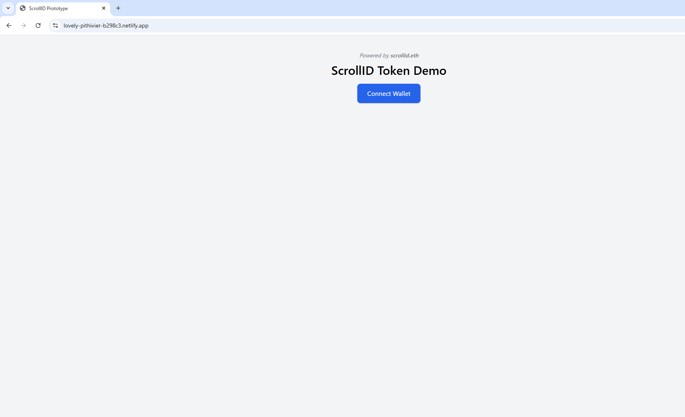

# ScrollID Token (SID)

> 🧪 Experimental prototype for identity-token UX in the Scroll ecosystem.

---

## 🔍 Overview

**ScrollID Token (SID)** is a proof-of-concept project that explores how identity-token mechanisms can be implemented using ENS, wallet binding, and ZK-ready infrastructure — anchored by the reserved ENS domain `scrollid.eth`.

This project is **not affiliated** with Scroll, Scroll Foundation, or any official entity.  
It serves as a technical artifact to illustrate how ENS-linked identity layers could be implemented in ZK-rollup environments like Scroll.

---

## 💡 Potential Use Cases

- **Verified Wallet Identity Binding**  
  Map a user’s wallet to a clean sub-identity (e.g., `user.scrollid.eth`) for use across Scroll-native applications.

- **ZK Attestation Anchors**  
  Serve as a base layer for verifiable credentials, zero-knowledge proofs, or account abstraction schemes.

- **ENS-integrated UX for Scroll Apps**  
  Enable ENS-based logins, token-gated interactions, and decentralized session identities.

- **Delegated Access / Session Tokens**  
  Support ephemeral, role-based, or delegated identity states within Scroll-powered dapps.

---

## 🛠 Live Demo & Assets

- ENS: [`scrollid.eth`](https://app.ens.domains/name/scrollid.eth)
- UI Demo: [https://scrollid-ui.netlify.app](https://scrollid-ui.netlify.app)
- Source: [GitHub](https://github.com/your-org/scrollid-prototype)

> ENS `text-record` is configured to reference this repository and relevant contact info.

---

## 📦 Tech Stack

| Component     | Tech                          |
|---------------|-------------------------------|
| Smart Contract| ERC-20 via OpenZeppelin       |
| Frontend      | React + TailwindCSS + Ethers.js |
| Hosting       | Netlify                       |
| ENS Support   | Reverse resolution + Records  |

---

## 🛡 Disclaimer

This is a public prototype project, published under the MIT license.  
There is no affiliation with Scroll or its affiliated projects.

Wallet connection is handled locally via MetaMask.  
No personal data is collected or processed. This is a frontend-only PoC.

---

## 📩 Contact

The ENS domain `scrollid.eth` is currently reserved to prevent unauthorized usage and future brand confusion.  
If you are affiliated with the Scroll ecosystem and wish to coordinate or inquire further, please refer to the contact listed in the ENS `text-record`.

---
